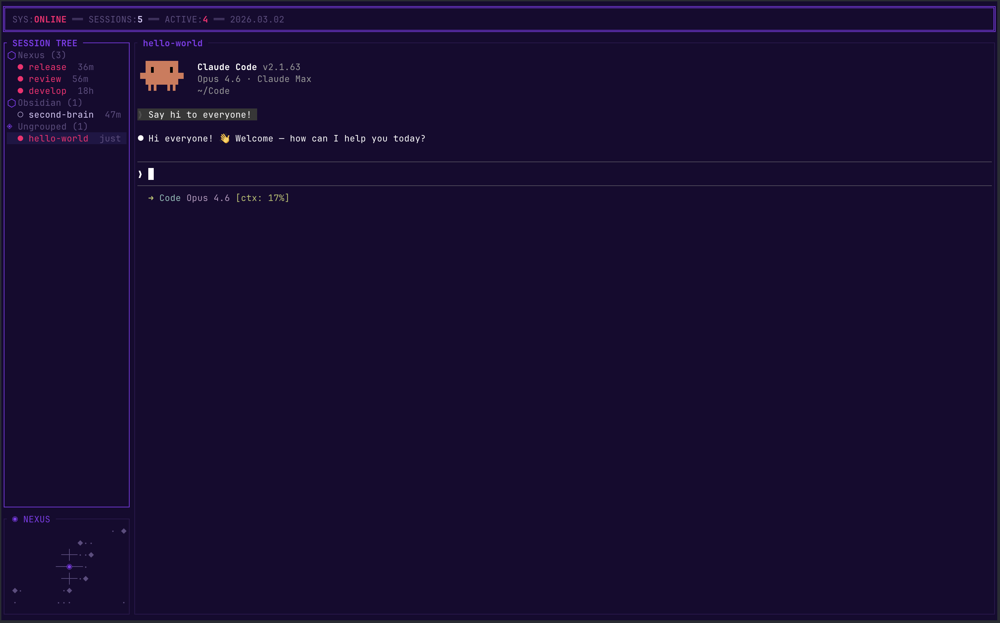

# Nexus

TUI session manager for [Claude Code](https://docs.anthropic.com/en/docs/claude-code).




Nexus gives you a persistent, organized workspace for managing multiple Claude Code sessions. It wraps each session in a tmux pane with a live terminal preview, groups sessions by project, and lets you switch between them instantly — all in a single terminal window.

## Features

- **Live terminal preview** — see Claude Code output in real-time without switching windows
- **Session grouping** — organize sessions by project via config or on-the-fly
- **Fullscreen attach** — jump into any session with `Alt+f`, detach back to the dashboard
- **8 color themes** — cycle with `Alt+t`, persisted across restarts
- **Session lifecycle** — create, rename, move, delete, and kill sessions from the TUI or CLI
- **Worktree isolation** — optionally create a dedicated git worktree per session for branch-level isolation
- **Claude session resume** — automatically detects Claude Code session IDs so relaunched sessions resume where they left off
- **CLI + JSON output** — scriptable interface for all operations (`nexus list --json`)
- **Lazygit integration** — open lazygit in any session's working directory with `Alt+l`
- **Text selection** — click+drag in the session panel to select and copy text (via OSC 52)
- **Feedback detection** — automatically detects when Claude is waiting for permission or confirmation across all sessions, pulsing the session tree row with a glow effect (no setup required)

## Install

Requires [tmux](https://github.com/tmux/tmux) and a [Rust toolchain](https://rustup.rs/).

```sh
# From GitHub
cargo install --git https://github.com/markx3/nexus-tui

# From source
git clone https://github.com/markx3/nexus-tui.git
cd nexus-tui
cargo install --path .
```

Optional: [lazygit](https://github.com/jesseduffield/lazygit) for the `Alt+l` git integration.

## Usage

### TUI Mode

Run `nexus` with no arguments to launch the interactive dashboard.

```sh
nexus
```

The TUI shows a session tree on the left and a live terminal preview on the right. All Nexus controls use the **Alt+key** namespace — every other key is forwarded directly to the embedded Claude Code session.

### Keybindings

| Key | Action |
|-----|--------|
| `Alt+q` | Quit Nexus |
| `Alt+h` / `Alt+?` | Toggle help overlay |
| `Alt+j` | Cursor down |
| `Alt+k` | Cursor up |
| `Alt+Enter` | Toggle expand/collapse group |
| `Alt+n` | New session |
| `Alt+g` | New group |
| `Alt+r` | Rename selected item |
| `Alt+m` | Move session to group |
| `Alt+d` | Delete selected item |
| `Alt+x` | Kill tmux session (mark detached) |
| `Alt+H` | Toggle past/dead sessions |
| `Alt+f` | Fullscreen attach to session |
| `Alt+t` / `Alt+T` | Cycle theme forward/backward |
| `Alt+l` | Open lazygit in session cwd |
| `Alt+p` | Session finder (fuzzy search) |

**Scrolling:**

| Key | Action |
|-----|--------|
| `Shift+Up/Down` | Scroll live view line-by-line |
| `Shift+PageUp/PageDown` | Scroll live view by 10 lines |
| Mouse scroll | Scroll live view or conversation log |
| Click+drag (session panel) | Select text and copy to clipboard |
| `Up/Down/PageUp/PageDown` | Scroll conversation log (dead/detached sessions) |

### CLI Mode

Most subcommands support `--json` for machine-readable output.

```sh
nexus list                           # List active sessions
nexus list --all                     # Include dead/past sessions
nexus show <id>                      # Show session details (ID prefix supported)
nexus new <name>                     # Create and launch a new session
nexus new <name> -c /path -g mygroup # With cwd and group
nexus new <name> -w                  # Create with an isolated git worktree
nexus launch <id>                    # Launch/resume a session in tmux
nexus kill <name>                    # Kill a running tmux session
nexus groups                         # List configured groups
nexus send <name> <text>             # Send text to a tmux session
nexus capture <name>                 # Capture pane contents
nexus capture <name> --strip         # Capture without ANSI codes
nexus delete <id>                    # Delete a session from the database
nexus delete <id> --remove-worktree  # Also clean up the git worktree
nexus rename <id> <name>             # Rename a session
nexus move <id> --group <name>       # Move session to a group
nexus group-create <name>            # Create a new group
```

## Configuration

Nexus reads its config from `~/.config/nexus/config.toml`. All fields are optional.

```toml
[general]
# db_path = "~/.local/share/nexus/nexus.db"  # default

[tmux]
# socket_name = "nexus"  # default; uses `tmux -L nexus`

# Define groups for organizing sessions
[[groups]]
name = "work"

[[groups]]
name = "personal"
```

### Groups

Groups organize your sessions in the tree view. Create them in the config file or on-the-fly with `Alt+g` in the TUI or `nexus group-create` from the CLI.

### Themes

8 built-in themes, cycled with `Alt+t` / `Alt+T`. Your selection is persisted.

| # | Theme |
|---|-------|
| 0 | Current Baseline |
| 1 | Outrun Sunset |
| 2 | Cyberpunk 2077 |
| 3 | Blade Runner 2049 |
| 4 | Neon Deep Ocean |
| 5 | Synthwave Nights |
| 6 | Retrowave Pure *(default)* |
| 7 | Matrix Phosphor |

### Worktree Isolation

When creating a session in a git repo, Nexus can create a dedicated git worktree so each session works on an isolated branch. In the TUI, you'll be prompted with "Isolate in git worktree? (y/n)" after entering a CWD that is a git repo. From the CLI, use `nexus new <name> -w`.

Worktree sessions show a branch badge (e.g., `[my-app/fix-bug]`) in the session tree. When deleting a worktree session, you'll be prompted with `y` (delete both), `n` (cancel), or `s` (session only, keep worktree on disk).

**Branch prefix:** By default, worktree branches are prefixed with the repo directory name (e.g., `my-app/fix-bug`). You can override this globally in `~/.config/nexus/config.toml` or per-repo in `.nexus.toml` at the repo root:

```toml
# ~/.config/nexus/config.toml (global)
[worktree]
branch_prefix = "team"    # all repos: team/fix-bug
```

```toml
# .nexus.toml (per-repo, overrides global)
[worktree]
branch_prefix = "custom"  # this repo: custom/fix-bug
# branch_prefix = ""      # or disable prefix entirely: fix-bug
```

**Convention hooks:** If `.nexus/on-worktree-create` exists in the repo root and is executable, Nexus delegates worktree creation to it instead of running `git worktree add`. Similarly for `.nexus/on-worktree-teardown`. Hooks receive environment variables: `NEXUS_WORKTREE_PATH`, `NEXUS_BRANCH`, `NEXUS_SESSION_NAME`, `NEXUS_REPO_ROOT`.

## Terminal Setup (macOS)

Nexus uses **Alt+key** shortcuts for navigation and commands. On macOS, the Option key produces special characters by default (e.g., Option+M types `µ`) instead of the Alt/Meta sequences that terminal applications expect.

You **must** configure your terminal to treat Option as Meta/Alt, or Alt keybindings will not work.

### Ghostty

Add to `~/.config/ghostty/config`:

```
macos-option-as-alt = true
```

Restart Ghostty after changing this setting.

### iTerm2

Settings > Profiles > Keys > General > Left Option key: **Esc+**

(Repeat for Right Option key if desired.)

### Terminal.app

Settings > Profiles > Keyboard > **Use Option as Meta key**

### Kitty

Add to `~/.config/kitty/kitty.conf`:

```
macos_option_as_alt yes
```

### Alacritty

No configuration needed -- Alacritty treats Option as Alt by default on macOS.

### WezTerm

Add to `~/.config/wezterm/wezterm.lua`:

```lua
config.send_composed_key_when_left_alt_is_pressed = false
config.send_composed_key_when_right_alt_is_pressed = false
```

## Platform Support

- **macOS** — primary development platform, fully supported
- **Linux** — supported (tmux + standard terminal required)
- **Windows** — not supported (tmux dependency)

## Notes

- Nexus uses a dedicated tmux socket (`tmux -L nexus`). Sessions created in your default tmux server won't appear in Nexus, and vice versa.
- Data is stored in SQLite at `~/.local/share/nexus/nexus.db` with WAL mode.
- If Nexus crashes and won't restart due to a stale lock, remove `~/.cache/nexus/nexus.lock`.

## License

[MIT](LICENSE)
